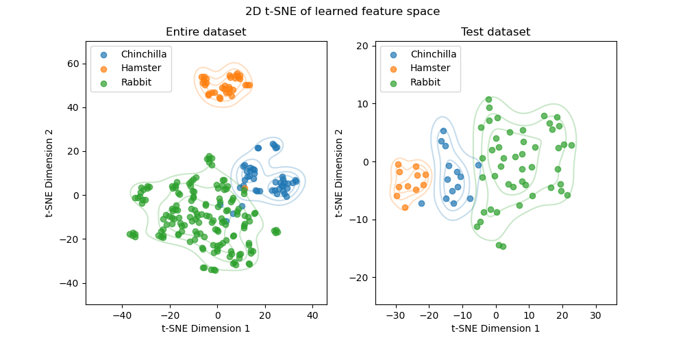

# Code challenge: self-supervised learning and embeddings generation
## Introduction
This repository contains the code to solve a challenge involving a self-supervised learning task involving pet images. 
## General approach
To address this challenge, the following approach was taken:
* A pre-trained encoder was customised, closely following the approach of [Chen et al. (2020), A Simple Framework for Contrastive Learning of Visual Representation](https://arxiv.org/abs/2002.05709), i.e. the SimCLR approach.
* SimCLR was used to conduct semi-supervised training of this custom model, using augmented versions of the data without labels.
* After the SimCLR step, the projection head was discarded, the encoder and its weights was retained, and a new 3-class classifier was added. 
* The predictive performance of the new model was evaluated by fine-tuning in the context of 5-fold cross-validation, using training data with labels.
* The model was then fine-tuned on the full labelled dataset.
* The performance of the fine-tuned model was evaluated on a hold-out, unseen test set of labelled data.
* An embedding of the model output in a 2D feature-space was demonstrated.
## Contents of repo
This repo contains the following items:
* [requirements.yaml](requirements.yaml): A minimal conda requirements file, detailing the required Python packages. 
* [code-challenge.ipynb](code-challenge.ipynb): A Jupyter notebook containing the code and a narrative of the approach.
* [feature_space_clusters.png](feature_space_clusters.png): The final plots, which demonstrate the embedding of features generated by the fine-tuned model in 2D t-distributed stochastic neighbour embedding (t-SNE) space.
* [model_simclr_weights.pth](model_simclr_weights.pth): Saved dictionary of model parameters for the pytorch model, after SimCLR pre-training.
* [model_finetuned_weights.pth](model_finetuned_weights.pth): Saved dictionary of model parameters for the pytorch model, after fine-tuning.
## 2D embedding of features

